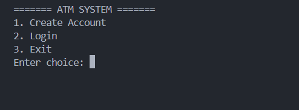
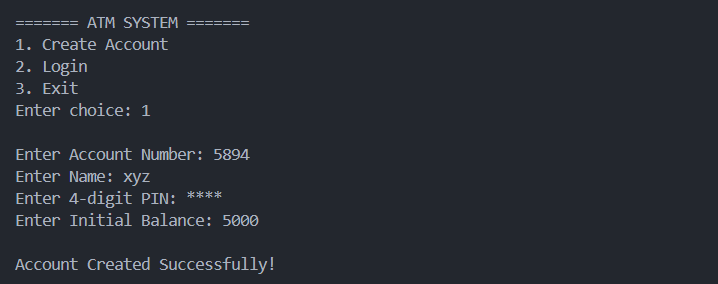
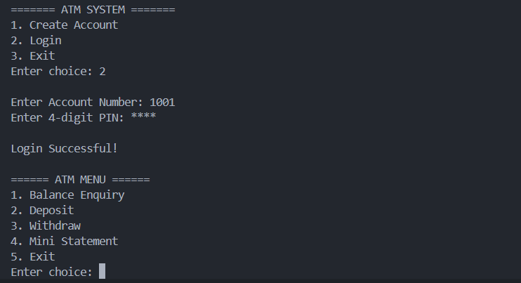
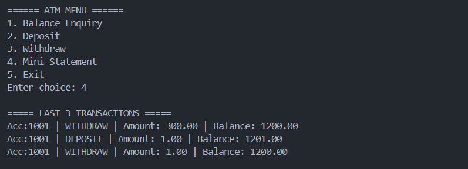

# 🏧 ATM Management System in C


A console-based ATM Management System built in **C** that simulates basic banking operations using **Structures, File Handling, and Binary Files**. The application enables users to securely create accounts, authenticate using a PIN, perform transactions, and maintain transaction history through persistent file storage.

---

## 📌 Features

- 🔐 Secure Login with 4-Digit PIN (Masked Input)
- 👤 Create New Account
- 💰 Deposit Money
- 💸 Withdraw Money
- 📊 Balance Enquiry
- 🧾 Mini Statement (Last 3 Transactions)
- 💾 Binary File Storage for Account Data
- 📝 Transaction History Logging
- ⚠️ Input Validation and Error Handling

---

## 🛠️ Technologies Used

- C Programming
- Structures (`struct`)
- Functions
- Pointers
- File Handling
- Binary File Operations
- String Library (`string.h`)
- Console-Based Application

---

## 📂 Project Structure

```
ATM-Management-System/
│
├── atm.c
├── accounts.txt
├── history.txt
├── .gitignore
├── LICENSE
├── README.md
└── screenshots/
    ├── home.png
    ├── create-account.png
    ├── login-menu.png
    └── mini-statement.png
```

---

## ⚙️ How It Works

### 1. Create Account
- Enter Account Number
- Enter Name
- Create a Secure 4-Digit PIN
- Set Initial Balance

### 2. Login
- Enter Account Number
- Enter PIN (Hidden Input)
- Authentication using stored account records

### 3. Banking Operations
- Balance Enquiry
- Deposit Money
- Withdraw Money
- View Last 3 Transactions

---

## 💾 Data Storage

This project uses local files for persistent storage.

| File | Purpose |
|------|----------|
| `accounts.txt` | Stores account details in binary format |
| `history.txt` | Stores transaction history |

> **Note:** These files are automatically created and updated by the program.

> Account information is stored in binary format, while transaction history is stored in a readable text file.
---

## ▶️ How to Run

### Compile

```bash
gcc atm.c -o atm
```

### Run

```bash
./atm
```

For Windows (MinGW):

```bash
gcc atm.c -o atm.exe
atm.exe
```
### Requirements

- GCC Compiler (MinGW GCC on Windows or GCC on Linux/macOS)

---

## 📸 Screenshots

### 🏠 Home Screen



---

### 👤 Create Account



---

### 🔐 Login & ATM Menu



---

### 🧾 Mini Statement



---

## 📚 Concepts Demonstrated

- Structured Programming
- Modular Functions
- Authentication System
- Binary File Handling
- Persistent Data Storage
- Input Validation
- Banking Operations Simulation
- Menu-Driven Programming

---

## 🎯 Key Learning

Through this project, I learned:

- Working with structures and modular programming in C
- Binary file handling for persistent data storage
- Implementing PIN-based authentication
- Managing transaction history using file handling
- Designing a menu-driven console application

---

## 🚀 Future Improvements

- Money Transfer Between Accounts
- Change PIN
- Delete Account
- Admin Panel
- Interest Calculation
- Date & Time in Transaction History
- Account Search Feature

---

## 👨‍💻 Author

**Krish Jaiswal**

BCA (Hons.) – AI & Data Science

- **GitHub:** https://github.com/krishjais783
- **LinkedIn:** https://www.linkedin.com/in/krish-jaiswal-0765a0375/

---


## ⭐ If you found this project useful

Give this repository a ⭐ on GitHub.

## 📄 License

This project is licensed under the MIT License.